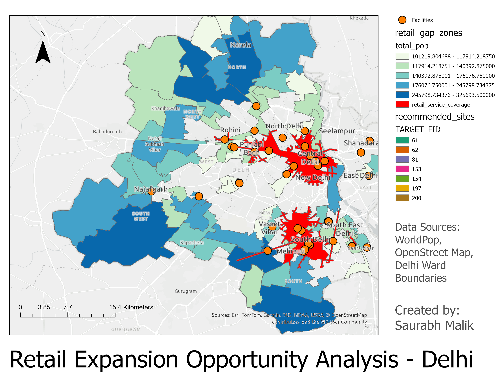

# Retail Expansion Strategy Using Geospatial Analytics

## Overview

This project identifies **optimal locations for retail expansion in Delhi, India** using geospatial analytics and network-based accessibility analysis.

By combining **population demand, existing retail store locations, road network accessibility, and land-use data**, the analysis identifies underserved high-demand zones where new retail stores could be strategically located.

The project demonstrates how **location intelligence and spatial analytics** can support data-driven retail expansion decisions.

---

## Business Problem

Retail companies must carefully select store locations to maximize market coverage while minimizing competition overlap.

This project addresses the following questions:

- Where are the **high population demand zones** in Delhi?
- Which areas are **already served by existing retail stores**?
- Where are the **retail accessibility gaps**?
- Which locations represent **high-potential retail expansion opportunities**?

---

## Data Sources

| Dataset | Source | Description |
|-------|-------|------------|
| Population Density | WorldPop | High-resolution gridded population dataset |
| Retail Locations | OpenStreetMap | Points of interest representing retail stores |
| Road Network | OpenStreetMap | Road infrastructure used for network analysis |
| Administrative Boundaries | Delhi Ward Boundaries | Used to define study area |

---

## Tools and Technologies

- ArcGIS Pro
- ArcGIS Network Analyst
- OpenStreetMap
- WorldPop Population Dataset
- GeoJSON / Shapefiles

---

## Methodology

### 1. Population Demand Analysis

WorldPop population data was processed and aggregated to identify **high-density population areas across Delhi**.

These areas represent **strong potential customer demand**.

---

### 2. Retail Competitor Mapping

Retail-related locations such as supermarkets, malls, convenience stores, restaurants, and cafes were extracted from **OpenStreetMap**.

These represent **existing retail competitors**.

---

### 3. Road Network Preparation

Road network data was processed and converted into a **network dataset** to support routing and accessibility analysis.

This enables realistic distance calculations along road infrastructure.

---

### 4. Service Area Analysis

Network service areas were generated around existing retail stores using three distance thresholds:

| Distance | Interpretation |
|--------|---------------|
| 2 km | Local retail access |
| 3 km | Neighborhood retail coverage |
| 5 km | Broader city-level accessibility |

These polygons represent areas already **served by existing retail stores**.

---

### 5. Identification of Retail Coverage Gaps

High population zones were compared against retail service areas to detect locations that fall **outside existing retail coverage**.

These locations represent **potential retail market gaps**.

---

### 6. Suitability Analysis

Candidate expansion locations were evaluated using multiple spatial criteria:

- Population density
- Distance from existing retail stores
- Proximity to road infrastructure
- Commercial land-use suitability

Each location was assigned a **suitability score** to identify the most promising retail expansion zones.

---

## Final Output

The final analysis identifies **high-demand areas in Delhi that are underserved by existing retail stores**.

These locations represent **optimal candidates for retail expansion**.

---

## Final Map

The final map highlights:

- Population demand zones  
- Existing retail store coverage  
- Retail service areas (2 km, 3 km, 5 km)  
- Recommended retail expansion zones  

---

## Workflow Visualization

### Population Density Map

### Existing Retail Locations

### Retail Service Areas

### Recommended Expansion Zones

---

## Key Insights

- Retail coverage is concentrated in **central urban areas**.
- Peripheral districts show **high population density but lower retail accessibility**.
- Several residential clusters remain **outside the 5 km retail service radius**.
- Expanding retail stores in these zones could **significantly improve market coverage**.

---

## Project Structure

Retail-Expansion-Geospatial-Analysis
│
├── data
│ ├── retail_points.geojson
│ ├── high_population_wards.geojson
│ └── final_retail_sites.geojson
│
├── maps
│ └── retail_expansion_map.png
│
├── screenshots
│ ├── 01_population_density.png
│ ├── 02_retail_points.png
│ ├── 03_service_areas.png
│ └── 04_final_sites.png
│
├── docs
│ └── project_summary.pdf
│
└── README.md

---

## Applications

This methodology can be applied to:

- Retail site selection
- Supply chain and logistics planning
- Urban planning and infrastructure placement
- Location intelligence consulting
- Market accessibility analysis

---

## Author

**Saurabh Malik**

Geospatial Analytics | Data Science | Location Intelligence